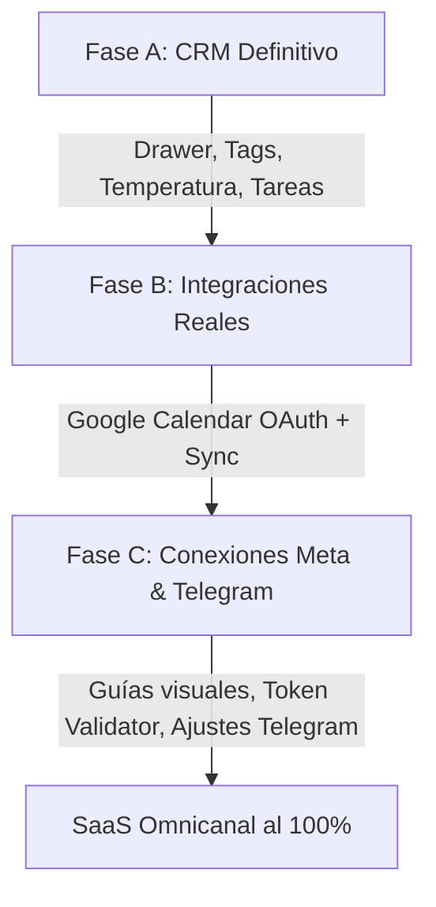

# 📊 Análisis Exhaustivo y Plan de Mejora (Ruta al 100%)
Este documento presenta un diagnóstico detallado del estado actual de las integraciones y módulos del sistema (Frontend, Backend y Live Chat), desmintiendo falsos positivos, identificando ausencias reales y trazando la hoja de ruta definitiva para convertir el sistema en un SaaS de nivel empresarial.

---

## 1. ⚙️ Diagnóstico de Despliegue en Netlify (Frontend)
El mensaje de cancelación en Netlify: `"Canceled build due to no content change"` **no representa un fallo en el código ni una caída del sistema**. 
Netlify utiliza un sistema de optimización de construcción para monorrepositorios. Si detecta que no se han realizado cambios en los directorios especificados en la configuración de base del frontend (`apps/frontend`), cancela automáticamente el proceso de compilación para ahorrar minutos de procesamiento. 

En cuanto realicemos cambios en el código del frontend (como en el CRM, el Drawer de Leads o las guías de los canales), Netlify detectará la modificación de archivos y ejecutará la construcción de manera exitosa.

---

## 2. 🔍 Diagnóstico Técnico de Módulos e Integraciones (Estado Real)

Tras una revisión profunda del código fuente en el backend, frontend y la base de datos, aquí está el estado técnico real de cada uno de los elementos mencionados:

### 🟢 Google Sheets: **¡COMPLETO Y REAL!**
*   **Estado:** **100% Funcional.**
*   **Detalle:** Contrario a lo que se pensaba, el archivo [google-sheets.adapter.ts](file:///c:/Users/pedro/Downloads/sysbot-main/sysbot-main/apps/backend/src/modules/crm/adapters/google-sheets.adapter.ts) **no es un simulacro**. Utiliza la librería oficial de Google (`googleapis`) de forma correcta.
*   **Flujo Técnico:**
    1.  Carga las credenciales del archivo JSON de una cuenta de servicio de Google (`service_account`) a través del campo `accessToken`.
    2.  Se conecta a la hoja de cálculo por su `spreadsheetId`.
    3.  El método `ensureSheetsExist()` crea automáticamente las pestañas **"Contactos"**, **"Deals"** y **"Tasks"** con sus cabeceras si no existen.
    4.  Sincroniza en tiempo real la creación/edición de leads y negocios (`createContact`, `updateContact`, `createDeal`, `createTask`) añadiendo filas reales a Google Sheets.
    5.  El frontend en [crm/page.tsx](file:///c:/Users/pedro/Downloads/sysbot-main/sysbot-main/apps/frontend/src/app/(dashboard)/integrations/crm/page.tsx) cuenta con el formulario completo para registrar esta conexión (ID de hoja de cálculo y JSON de cuenta de servicio).
*   **Mejora sugerida:** Validar con credenciales de usuario reales y asegurar que el correo de la cuenta de servicio tenga permisos de "Editor" en la hoja de cálculo.

### 🟡 CRM / Gestor de Leads: **PARCIALMENTE COMPLETO**
*   **Estado:** **Esqueleto funcional con interfaz interactiva.**
*   **Detalle:** El tablero Kanban en [leads/page.tsx](file:///c:/Users/pedro/Downloads/sysbot-main/sysbot-main/apps/frontend/src/app/(dashboard)/leads/page.tsx) es interactivo y muy robusto. Permite arrastrar leads, cambiar sus estados, ver un Drawer lateral para editar información básica (Nombre, Teléfono, Email, Columna), añadir Notas Internas de Venta y ver el **historial de conversación en tiempo real conectado a WhatsApp/Messenger** e incluso enviar respuestas rápidas por WhatsApp.
*   **Lo que falta (Ruta al 100%):**
    *   **Temperatura del Lead:** Falta el selector de nivel de temperatura (Frío, Tibio, Caliente) en la UI y el backend.
    *   **Etiquetas personalizadas (Tags):** No están expuestas en el Drawer lateral para organizar leads rápidamente.
    *   **Tareas y Recordatorios:** El backend de CRM cuenta con soporte de tareas, pero el panel lateral no permite visualizar ni añadir tareas pendientes asociadas al lead.
*   **Estrategia de Base de Datos:** El modelo `Lead` en [schema.prisma](file:///c:/Users/pedro/Downloads/sysbot-main/sysbot-main/packages/database/prisma/schema.prisma) ya cuenta con un campo `metadata: Json?`. Para evitar migraciones de base de datos costosas y de alto riesgo en producción, implementaremos la temperatura del lead, tags y tareas adicionales usando este campo `metadata` estructurado en formato JSON.

### 🟢 Meta Business (Messenger / Instagram): **FUNCIONAL EN BACKEND, REQUIERE GUÍAS EN FRONTEND**
*   **Estado:** **Backend completo, Frontend requiere soporte instruccional.**
*   **Detalle:** El backend de Messenger ([messenger.service.ts](file:///c:/Users/pedro/Downloads/sysbot-main/sysbot-main/apps/backend/src/modules/meta/messenger/messenger.service.ts)) y OAuth ([meta-oauth.service.ts](file:///c:/Users/pedro/Downloads/sysbot-main/sysbot-main/apps/backend/src/modules/oauth/meta-oauth.service.ts)) está sumamente desarrollado. Gestiona el intercambio de códigos OAuth por tokens de larga duración de Meta, lista las páginas de Facebook de forma interactiva y maneja Webhooks para procesar mensajes entrantes utilizando la IA.
*   **Lo que falta (Ruta al 100%):**
    *   La página de configuración de canales ([channels/page.tsx](file:///c:/Users/pedro/Downloads/sysbot-main/sysbot-main/apps/frontend/src/app/(dashboard)/channels/page.tsx)) permite rellenar de forma manual campos como `Page ID`, `Access Token` y `Verify Token`, pero es compleja para un usuario final.
    *   **Guía paso a paso en UI:** Falta añadir un acordeón o tooltip interactivo que le indique al usuario cómo obtener sus credenciales en *developers.facebook.com* y cómo configurar la URL de webhook del backend en la consola de Meta.
    *   **Verificación activa de tokens:** El backend tiene un endpoint de salud (`/oauth/meta/health`), pero solo revisa la existencia de los datos en la base de datos. Sería ideal implementar una llamada de prueba real contra Facebook Graph API (`/me`) para alertar activamente si el token ha expirado.

### 🟡 Telegram: **BOT COMPLETADO | PERSONAL (USERBOT) SIMULADO**
*   **Estado:** **Telegram Bot listo y real. Telegram Personal es una maqueta.**
*   **Detalle:** 
    *   **Telegram Bot** ([telegram.service.ts](file:///c:/Users/pedro/Downloads/sysbot-main/sysbot-main/apps/backend/src/modules/telegram/telegram.service.ts)) es 100% real: conecta contra `api.telegram.org` usando un Bot Token de `@BotFather`, registra el webhook automáticamente y responde usando el motor de IA.
    *   **Telegram Personal (Userbot)** ([business.service.ts](file:///c:/Users/pedro/Downloads/sysbot-main/sysbot-main/apps/backend/src/modules/business/business.service.ts)): El flujo simula la conexión. El backend genera un código de verificación interno aleatorio y simula el estado `CONNECTED` en la base de datos sin interactuar de forma real con los servidores de Telegram mediante protocolos MTProto (como `gramjs` o `tdlib`).
*   **Lo que falta (Ruta al 100%):**
    *   Mejorar la usabilidad del Bot oficial.
    *   Sustituir o advertir el alcance del modo Telegram Personal o programar un microservicio Userbot real basado en librerías de cliente Telegram MTProto si el cliente final lo requiere.

### 🔴 Google Calendar: **INEXISTENTE**
*   **Estado:** **No implementado.**
*   **Detalle:** El módulo de citas ([appointments.service.ts](file:///c:/Users/pedro/Downloads/sysbot-main/sysbot-main/apps/backend/src/modules/appointments/appointments.service.ts)) realiza un trabajo local excelente: gestiona agendas en la base de datos Postgres, calcula horarios disponibles, se sincroniza con el expediente clínico electrónico (EHR) local y gestiona listas de espera inteligentes cuando un turno se libera. Sin embargo, **no tiene código de integración con Google Calendar API ni flujo OAuth2 para Google**.
*   **Lo que falta (Ruta al 100%):**
    *   Crear el flujo OAuth2 de Google para negocios.
    *   Desarrollar un adaptador de Google Calendar en el backend para crear, actualizar y cancelar eventos automáticamente al momento de gestionar reservas de citas.

---

## 3. 🗺️ Plan de Acción y Hoja de Ruta al 100% (Fases de Desarrollo)

Para consolidar el sistema y llevarlo a un SaaS Omnicanal robusto y comercializable, se propone el siguiente plan estructurado por fases:

### 📋 Fase A: El CRM Definitivo (Frontend + Backend)
*   **Meta:** Enriquecer el Drawer lateral de leads para convertirlo en un CRM de alto desempeño comercial.
*   **Tareas:**
    1.  **Variables en Metadata:** Actualizar los endpoints de creación y edición en `LeadsService` para soportar campos dinámicos en el objeto `metadata` (temperatura: `cold | warm | hot`, etiquetas: `string[]`, recordatorios: `object[]`).
    2.  **UI de Temperatura:** En el Drawer de `leads/page.tsx`, añadir un selector visual de Temperatura usando insignias (Badges) con gradientes:
        *   🔴 **Caliente** (Alta probabilidad de compra / Negociación).
        *   🟡 **Tibio** (Contactado / Interés medio).
        *   🔵 **Frío** (Prospecto nuevo / Poco interés).
    3.  **UI de Etiquetas (Tags):** Implementar un input de tags dinámicos dentro del Drawer lateral que permita añadir o remover etiquetas para una segmentación rápida del lead.
    4.  **Gestión de Tareas:** Diseñar una sección dentro del Drawer de Leads para registrar y visualizar pequeñas tareas/recordatorios (ej: "Llamar mañana a las 3:00 PM") almacenadas en `metadata.tasks`.

### 📅 Fase B: Integraciones Reales (Google Calendar + Hojas de Cálculo)
*   **Meta:** Proveer sincronización nativa en la nube para Google Sheets (ya listo para probar) y Google Calendar (desarrollo nuevo).
*   **Tareas:**
    1.  **Google Sheets (Verificación):** Crear un instructivo o añadir tooltips en el frontend `crm/page.tsx` para guiar al usuario en la creación de su cuenta de servicio en Google Cloud Platform y cómo compartir la hoja de cálculo.
    2.  **Google OAuth2 para Negocios:** Crear un nuevo controlador de OAuth para Google (`google-oauth.service.ts`) que permita a los administradores iniciar sesión con su cuenta de Google y otorgar permisos de lectura y escritura a su calendario.
    3.  **Sincronizador de Google Calendar:** Modificar `AppointmentsService` en el backend para que, tras la creación/edición exitosa de una cita local:
        *   Se conecte con la API de Google Calendar usando los tokens OAuth del negocio.
        *   Cree, actualice o cancele el evento en el calendario de Google en tiempo real.
        *   Guarde el `googleEventId` en la cita local para sincronizaciones futuras.

### 🌐 Fase C: Reparación de Conexiones Meta & Telegram
*   **Meta:** Optimizar el flujo de conexión de canales de mensajería para evitar fricción e inestabilidad.
*   **Tareas:**
    1.  **Paso a paso guiado en Meta:** Rediseñar la sección de Meta Messenger e Instagram en `channels/page.tsx` añadiendo un bloque instruccional o ayuda emergente:
        *   Cómo crear una App en Meta for Developers.
        *   Cómo dar permisos de páginas y generar el Token de Acceso de Página.
        *   Mostrar de forma clara la URL exacta de Webhook a copiar y el token de verificación configurado por el sistema.
    2.  **Validador de Tokens en Meta:** Implementar una prueba activa durante la conexión y en la pestaña de salud que realice una consulta real (`GET graph.facebook.com/me`) para garantizar que el token guardado funciona y no ha expirado.
    3.  **Telegram Bot UX:** Asegurar la consistencia al guardar el token de Telegram y añadir guías cortas sobre cómo usar `@BotFather` para obtener el token.

---

## 4. 🚀 Propuesta de Ejecución Inmediata
Para proceder de la forma más efectiva, se recomienda seguir el siguiente orden:

1.  **Paso 1:** Comenzar con la **Fase A (CRM Definitivo)** para enriquecer visualmente el panel de ventas y dar una excelente experiencia de usuario con etiquetas, temperaturas e historial integrado.
2.  **Paso 2:** Continuar con la **Fase B (Google Calendar)** para implementar la sincronización bidireccional de citas médicas/de negocios y verificar el correcto funcionamiento de Google Sheets en la nube.
3.  **Paso 3:** Culminar con la **Fase C (Canales)** para pulir la experiencia de integración de Messenger, Instagram y Telegram.

*Documento cargado en el repositorio: `/documentacion/ANALISIS_EXHAUSTIVO_Y_PLAN_DE_MEJORA.md`*
*Preparado para el inicio del desarrollo una vez aprobado.*
